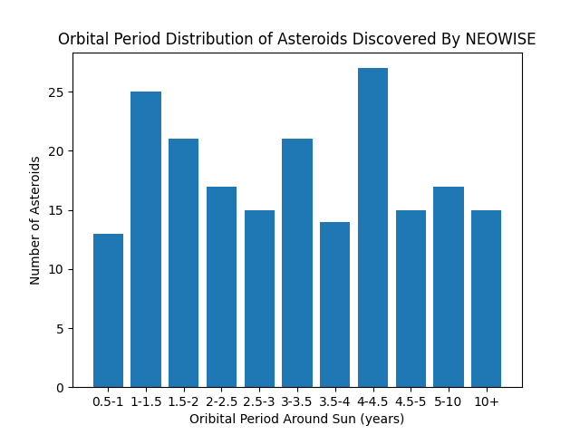

# matplotlib/project_02

[Instructions For Project_02](https://github.com/mikeizbicki/cmc-csci040/tree/2022fall/project_02)

**Orbital Period Distribution of Near-Earth Objects Discovered By NEOWISE**

This bar chart was created using data from [NASA](https://data.nasa.gov/resource/2vr3-k9wn.json). The dataset contains information regarding near-Earth Objects, or NEOs, which are asteroids or comets that pass close to Earth during their orbits around the Sun. The NEOs in this dataset were discovered by NEOWISE, a space-based telescope that launched in 2009. This bar chart tallies the distribution of the NEOs' orbital periods, which is how long it takes each object to orbit the sun. As shown in the chart, most of the NEOs have orbital periods of under five years, likely because NEOs with longer orbital periods are on average further away from the Earth and are therefore more dificult to find.

http://data.un.org/
http://data.un.org/_Docs/SYB/PDFs/SYB61_253_Population%20Growth%20Rates%20in%20Urban%20areas%20and%20Capital%20cities.pdf